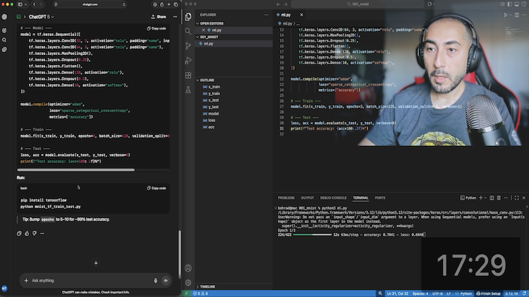
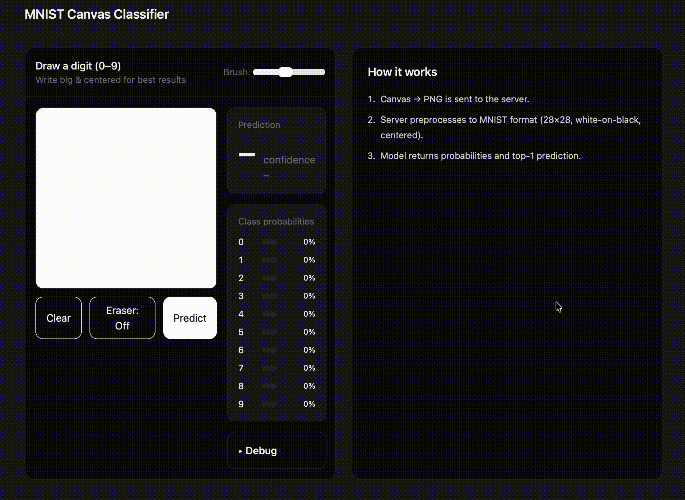
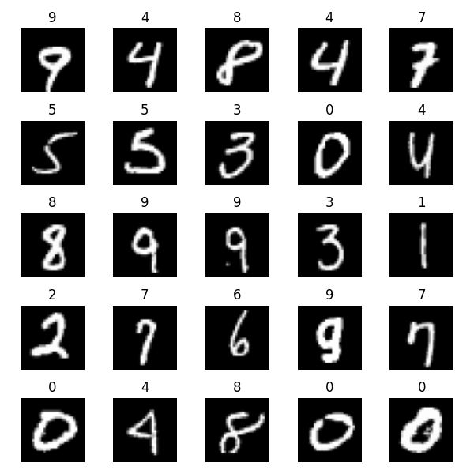

# Intro
This is the code associated with my YouTube video on 20 Minutes vibe coding an E2E ML product;
[](https://youtu.be/ibG_bie1OiU)

if you haven't seen the video you can find it [here](https://youtu.be/ibG_bie1OiU)

The end product is a website that would take a drawing from the user and would classify it as a digit between 0 to 9; it is using a model trained in tensorflow, a Python Flask backend and a Javascript based front end; 



# Setup
1. You'd need to have Python and virtual Env setup then use Pip to install rqeuirements 

   - setup the local env
    ```
    virtualenv myenv 
    source myenv/bin/activate
    pip install -r requirements.txt
    ```
    **Note**: you might need to use `pip3` insteald of `pip` 

2. Once done, you can run the flask app using 
```
python app.py
```
you might need to use `python3` (instead of python) depending how your system is set 

This would run the app on your local server

3. To access the app open a browser, go to `http://127.0.0.1:4000` 

**More Details**
- This project includes 3 ML modele training codes, each associatd with one model they are `ml.py`, `ml2.py`, `ml3.py`

by running either using ```python ml.py``` they would train a model using MNIST dataset and save the model locally, you can then use the trained model in `app.py` where you load the model for the backend; the code is already there for all models using the default filename 

- User inputs for each predicion will be saved as a png image undder `/processed_samples` this would help you look into what input look like, and if you want to expand the project to have additional labeled training dataset (this is a cool extension to consider if you want)

- To see some of the samples from MNIST dataset you can run `mnist_visualizer.py` it would output a sample of the training dataset in MNIST




- Entire ChatGPT conversation is recorded in [this link](https://chatgpt.com/share/6907fe29-86b8-8006-bdea-dd545ed2b401) if you want to explore